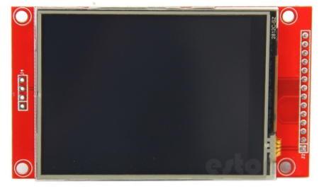
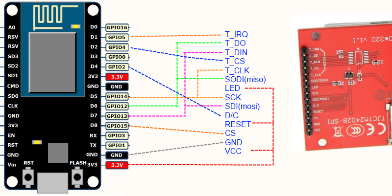

### *This page was retrieved from:
[https://nailbuster.com/?page_id=341](https://nailbuster.com/?page_id=341)*

### *Note from Jaggz: The purpose for this repository is to archive and make available a copy of a library I found where Nailbuster Software put in the effort to adapt libraries for this LCD display.  Specifically, I could not find another library which handled rotation while also supporting the ESP8266 with the ILI9341 (and this particular display possibly).*

## 2.8″ Touch LCD SPI for esp8266 (nodemcu)

Hey,  just finished playing with my new 2.8″ SPI touch TFT and getting it to work with a esp8266 (nodemcu) within the Arduino in windows…    It wasn’t something that ‘just worked’….I tried to get it to work a couple different ways and finally found a working solution.  I was able to get it to work with the AdaFruit_GFX library!  It uses SPI interface which lowers the pin count so that it can work with esp8266.  Other than power and ground….it uses 7 pins of the nodemcu…note that this device only worked with 3.3v logic..didn’t work with a arduino nano clone (5v) for me.

</figure>

This is the device I ordered from ali…..packaged well enough and works fine so far…model printed on back is TJCTM24028-SPI

Again came with no documentation but from what I gather it has a ILI9341 driver for screen and XPT2046 for touch driver….to try out my sample files connect the screen like this:  (you can change some pins (not the spi pins), but you’ll have to change code if you use different pins from the diagram).  Notice that the touch/lcd screen share the spi bus….only the cs pin needs to be unique.

 

I didn’t write the original code/touch drivers…but I had to modify the code a bit to get it to work for me….this is all beta stuff so try it out …..you can learn about the AdaFruit GFX library here:

## Instructions:

You will need to install the adafruit gfx library into Arduino from here:
[https://github.com/adafruit/Adafruit-GFX-Library](https://github.com/adafruit/Adafruit-GFX-Library)

You will need to install the XP2046 driver from here:
[https://github.com/spapadim/XPT2046](https://github.com/spapadim/XPT2046)

Credit goes to Spiros Papadimitriou for his work on the touch driver…..

download source zip files here

*(Note from Jaggz: The .zip files ARE this git repo)*
[http://nailbuster.com/nailcode/tft28esp.zip](http://nailbuster.com/nailcode/tft28esp.zip)

You will find in the zip file :

You will need to copy the Adafuit_ILI9341esp folder to your arduino libraries folder (remember to restart arduino).

You will find two sample projects:  XPTPaint will show you how to do drawing and also show a sample button!

XPTCalibrate will give you your custom calibration numbers that you can set for your screen.  (you can change the XPTPaint setup function to your calibration numbers).

